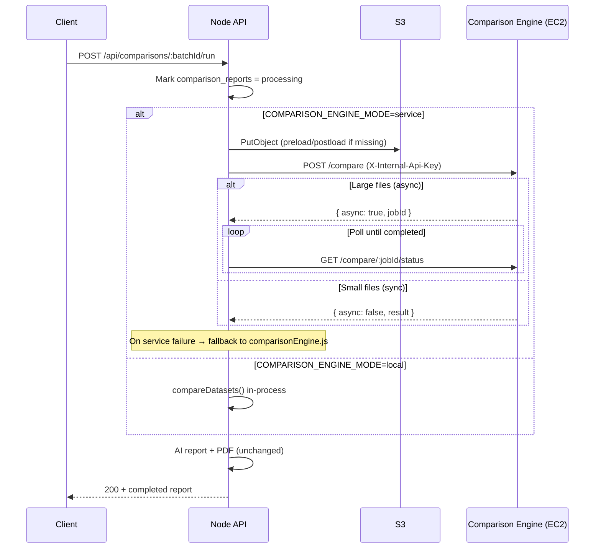

# Comparison Engine (EC2)

Standalone FastAPI service that compares preload/postload SAP migration files. It replaces the inline Node `comparisonEngine.js` logic for large-file workloads, using **python-calamine** for unified xlsx/csv reads and **pandas** for in-memory comparison.

This service is **internal only** — it must not be reachable from the public internet. The Node backend calls it over the VPC with a shared API key (`X-Internal-Api-Key`).

> **Keep this README updated.** When you change comparison behavior, deployment, or Node integration, add a short entry to [Changelog](#changelog) at the bottom so future readers can see what changed and when.

---

## Architecture



| Component | Location | Role |
|-----------|----------|------|
| Python service | `services/comparison-engine/` | S3 download, file read, directional diff |
| Node orchestration | `src/routes/comparisons.js` | `POST /:batchId/run` endpoint |
| Node client | `src/services/comparisonRunner.js` | HTTP client, polling, fallback |
| Node S3 helper | `src/services/comparisonS3.js` | Upload local files before service call |
| In-process fallback | `src/services/comparisonEngine.js` | Original JS comparison (kept) |

---

## Node backend integration

The orchestration endpoint `POST /api/comparisons/:batchId/run` calls `runComparison()` from `comparisonRunner.js` instead of `compareDatasets()` directly.

### Modes

| `COMPARISON_ENGINE_MODE` | Behavior |
|--------------------------|----------|
| `local` (default) | Uses in-process `comparisonEngine.js` with parsed rows already in PostgreSQL |
| `service` | Calls the Python EC2 service; **falls back to local** if the service is unreachable (same pattern as validation Lambda → Node fallback) |

### Service-mode flow

1. Ensure preload/postload files exist in S3 (`comparisonS3.js` uploads from local `storage_path` if not already present).
2. `POST /compare` with S3 keys, `identifierColumns`, `batchId`, and shared API key header.
3. **Sync response** — use `result` JSON directly as `summary_json`.
4. **Async response** — poll `GET /compare/:jobId/status` every 3s (configurable) until `completed` or `failed`/timeout.
5. Pass `summary` to AI report generation and PDF export unchanged (output shape matches `comparisonEngine.js`).

### Response fields added to `/:batchId/run`

When using the service, the API response may include:

- `comparison_evaluator`: `"comparison-engine-service"` | `"node-local"` | `"node-local-fallback"`
- `comparison_fallback_reason`: present when service failed and local fallback was used

### Node environment variables

Set these in the **root** `.env` (see `.env.example`):

| Variable | Default | Description |
|----------|---------|-------------|
| `COMPARISON_ENGINE_MODE` | `local` | `local` or `service` |
| `COMPARISON_ENGINE_URL` | — | Internal URL, e.g. `http://10.0.1.50:8080` |
| `COMPARISON_INTERNAL_API_KEY` | — | Must match Python service key |
| `COMPARISON_S3_BUCKET` | — | Bucket for upload files (required in `service` mode) |
| `COMPARISON_ENGINE_TIMEOUT_MS` | `120000` | Timeout for `POST /compare` |
| `COMPARISON_ENGINE_POLL_INTERVAL_MS` | `3000` | Async job poll interval |
| `COMPARISON_ENGINE_ASYNC_TIMEOUT_MS` | `1800000` | Max wait for async job (30 min) |

### Node IAM (service mode)

The Node backend instance/task role needs:

```json
{
  "Effect": "Allow",
  "Action": ["s3:PutObject", "s3:HeadObject"],
  "Resource": "arn:aws:s3:::YOUR_BUCKET/*"
}
```

S3 keys mirror the local uploads layout: `{userId}/{batchId}/{filename}`.

---

## Comparison output shape

The service returns the same JSON structure as `src/services/comparisonEngine.js` (drop-in replacement):

```json
{
  "missingRecords": [{ "identifier": "...", "record": { } }],
  "missingValues": [{ "identifier": "...", "field": "...", "expectedValue": "..." }],
  "valueMismatches": [{ "identifier": "...", "field": "...", "expectedValue": "...", "actualValue": "..." }],
  "duplicateRecords": [{ "identifier": "...", "count": 2, "records": [] }],
  "baselineDuplicates": [{ "identifier": "...", "count": 2, "records": [] }],
  "extraRecords": [{ "identifier": "...", "record": { } }]
}
```

Downstream Bedrock/Groq report generation and PDF export require no changes.

---

## Python version

The Docker image targets **Python 3.12** (`python:3.12-slim`). Confirm with your team before changing the base image tag. Local development can use 3.12+; production should match the image.

---

## Project layout

```
services/comparison-engine/
├── app/                    # FastAPI routes, S3 I/O, job store
│   ├── main.py             # App entrypoint
│   ├── routes.py           # /health, /compare, /compare/:jobId/status
│   ├── service.py          # S3 download + orchestration
│   ├── s3.py, jobs.py, auth.py, config.py
├── comparison_engine/      # Pure comparison logic (no HTTP/S3)
│   ├── core.py             # compare_datasets (mirrors comparisonEngine.js)
│   └── file_reader.py      # python-calamine → pandas
├── deploy/                 # Optional systemd unit
├── tests/                  # 10 unit tests (pytest)
├── Dockerfile
├── docker-compose.yml
├── requirements.txt        # Production image dependencies
└── requirements-dev.txt    # Local testing (pytest, httpx)
```

---

## Dependencies (installed in the image)

| Package | Purpose |
|---------|---------|
| `fastapi` | HTTP API |
| `uvicorn` | ASGI server |
| `pandas` | DataFrame comparison |
| `python-calamine` | Read `.xlsx` / `.csv` via one interface |
| `boto3` | Download files from S3 |
| `pydantic` | Request validation |

---

## Build the image

From the repository root:

```bash
cd services/comparison-engine
docker build -t comparison-engine:latest .
```

Verify locally:

```bash
cp .env.example .env
# Edit .env — set COMPARISON_INTERNAL_API_KEY

docker compose up --build -d
curl http://localhost:8080/health
# {"status":"ok"}
```

---

## Push to Amazon ECR

This repository does **not** currently define ECR/ECS infrastructure. Use the steps below when provisioning your registry.

### 1. Create an ECR repository (one-time)

```bash
aws ecr create-repository \
  --repository-name comparison-engine \
  --region ap-northeast-1
```

### 2. Authenticate Docker to ECR

```bash
AWS_ACCOUNT_ID=123456789012
AWS_REGION=ap-northeast-1

aws ecr get-login-password --region "$AWS_REGION" \
  | docker login --username AWS --password-stdin \
    "${AWS_ACCOUNT_ID}.dkr.ecr.${AWS_REGION}.amazonaws.com"
```

### 3. Tag and push

```bash
ECR_URI="${AWS_ACCOUNT_ID}.dkr.ecr.${AWS_REGION}.amazonaws.com/comparison-engine"

docker tag comparison-engine:latest "${ECR_URI}:latest"
docker tag comparison-engine:latest "${ECR_URI}:$(git rev-parse --short HEAD)"
docker push "${ECR_URI}:latest"
docker push "${ECR_URI}:$(git rev-parse --short HEAD)"
```

Pin deployments to the git-SHA tag for predictable rollbacks.

---

## Run on EC2

### Recommended approach: Docker with restart policy

Install Docker on the EC2 instance, then pull and run:

```bash
AWS_ACCOUNT_ID=123456789012
AWS_REGION=ap-northeast-1
ECR_URI="${AWS_ACCOUNT_ID}.dkr.ecr.${AWS_REGION}.amazonaws.com/comparison-engine"

aws ecr get-login-password --region "$AWS_REGION" \
  | docker login --username AWS --password-stdin \
    "${AWS_ACCOUNT_ID}.dkr.ecr.${AWS_REGION}.amazonaws.com"

docker pull "${ECR_URI}:latest"

docker run -d \
  --name comparison-engine \
  --restart unless-stopped \
  --env-file /opt/comparison-engine/.env \
  -p 8080:8080 \
  -v comparison-engine-downloads:/tmp/comparison-engine \
  "${ECR_URI}:latest"
```

**Process supervision:** `--restart unless-stopped` tells Docker to restart the container if the process exits or the host reboots (unless you explicitly stop it). This is the primary supervision mechanism — no separate supervisor is required when running via Docker.

### Alternative: docker compose on the instance

Copy `docker-compose.yml` and `.env` to `/opt/comparison-engine/`, set the image name in compose or pull from ECR first, then:

```bash
cd /opt/comparison-engine
docker compose up -d
```

`docker-compose.yml` sets `restart: unless-stopped` and includes a container health check against `GET /health`.

### Optional: systemd wrapper

If you want the container to start on boot via systemd (in addition to Docker's restart policy), use `deploy/comparison-engine.service`:

```bash
sudo mkdir -p /opt/comparison-engine
sudo cp docker-compose.yml .env.example /opt/comparison-engine/
# Edit /opt/comparison-engine/.env with production values

sudo cp deploy/comparison-engine.service /etc/systemd/system/
sudo systemctl daemon-reload
sudo systemctl enable --now comparison-engine
```

Update `Environment=COMPARISON_ENGINE_IMAGE=...` in the unit file to your ECR URI.

### EC2 instance profile (IAM)

The comparison-engine instance needs permission to read comparison files from S3:

```json
{
  "Effect": "Allow",
  "Action": ["s3:GetObject", "s3:HeadObject"],
  "Resource": "arn:aws:s3:::YOUR_BUCKET/*"
}
```

`HeadObject` is used to inspect file size before download (async mode threshold).

---

## Environment variables (Python service)

Copy `.env.example` to `.env` on the EC2 instance:

| Variable | Required | Description |
|----------|----------|-------------|
| `COMPARISON_INTERNAL_API_KEY` | Yes | Shared secret; Node sends this as `X-Internal-Api-Key` |
| `AWS_REGION` | Yes | Region for S3 client (e.g. `ap-northeast-1`) |
| `COMPARISON_PORT` | No | Default `8080` |
| `COMPARISON_DOWNLOAD_DIR` | No | Temp download path inside container (default `/tmp/comparison-engine`) |
| `COMPARISON_ASYNC_ROW_THRESHOLD` | No | Row count threshold for async jobs (default `50000`) |
| `COMPARISON_ASYNC_FILE_SIZE_BYTES` | No | Combined S3 file size threshold for async jobs (default 10 MB) |

---

## Security group configuration

The comparison engine must **never** be publicly reachable.

| Direction | Port | Source | Notes |
|-----------|------|--------|-------|
| Inbound TCP | `8080` (or your `COMPARISON_PORT`) | **Node backend security group only** | No `0.0.0.0/0`, no `::/0` |
| Outbound | HTTPS `443` | S3 gateway / NAT | S3 downloads |
| Outbound | (optional) | ECR | Image pulls on deploy |

Example (AWS CLI concept — adjust IDs):

```
Comparison Engine SG (sg-comparison):
  Inbound:  TCP 8080  from sg-node-backend  (description: Node API only)

Node Backend SG (sg-node-backend):
  Outbound: TCP 8080  to sg-comparison       (description: Comparison engine)
```

Place both instances in the **same VPC**. Use **private subnets** for the comparison engine instance; it does not need a public IP.

Authentication is enforced in-app via `X-Internal-Api-Key`, but network isolation is the first line of defense.

---

## Instance sizing

**Share your expected file sizes before picking a concrete instance type.** Needed inputs:

- Typical / maximum preload and postload file sizes (MB or GB)
- Approximate row counts per file
- Whether multiple comparisons run concurrently

### General guidance

- **pandas loads full DataFrames into memory.** Peak usage is roughly 2–3× the on-disk file size (both files plus comparison overhead).
- **Memory-optimized instances (AWS `r` family, e.g. `r6i`, `r7g`)** are a good fit when files are large or wide.
- Start with a single worker (`uvicorn` default). Multiple workers duplicate memory per process and are usually wrong for large pandas workloads.
- Disk: ensure enough ephemeral storage for downloaded files in `/tmp/comparison-engine` (the Docker volume `comparison-engine-downloads`).

---

## Deploying updates and rollbacks

1. Build and push a new image tag (prefer git SHA over `:latest` in production).
2. On the EC2 instance:

```bash
docker pull "${ECR_URI}:<new-tag>"
docker stop comparison-engine
docker rm comparison-engine
docker run -d \
  --name comparison-engine \
  --restart unless-stopped \
  --env-file /opt/comparison-engine/.env \
  -p 8080:8080 \
  -v comparison-engine-downloads:/tmp/comparison-engine \
  "${ECR_URI}:<new-tag>"
```

**Rollback:** repeat with the previous image tag.

With compose:

```bash
docker compose pull
docker compose up -d
```

---

## API reference (internal)

### `POST /compare`

**Headers:** `X-Internal-Api-Key`, `Content-Type: application/json`

**Body:**

```json
{
  "preloadS3Key": "userId/batchId/preload-....xlsx",
  "postloadS3Key": "userId/batchId/postload-....csv",
  "keyField": "MATNR",
  "identifierColumns": ["MATNR"],
  "bucket": "your-uploads-bucket",
  "batchId": "uuid",
  "compareColumns": ["optional"],
  "forceAsync": false
}
```

**Sync response:**

```json
{ "async": false, "batchId": "...", "result": { /* diff shape above */ } }
```

**Async response:**

```json
{ "async": true, "jobId": "...", "batchId": "...", "status": "pending" }
```

### Other endpoints

| Method | Path | Auth | Description |
|--------|------|------|-------------|
| `GET` | `/health` | None | Health check for monitoring / future load balancer |
| `GET` | `/compare/{jobId}/status` | `X-Internal-Api-Key` | Poll async job (`status`: `pending` \| `processing` \| `completed` \| `failed`) |

---

## Local development

```bash
cd services/comparison-engine
pip install -r requirements-dev.txt
cp .env.example .env
uvicorn app.main:app --reload --port 8080
pytest -v
```

To test end-to-end with the Node backend locally:

```env
# Root .env
COMPARISON_ENGINE_MODE=service
COMPARISON_ENGINE_URL=http://localhost:8080
COMPARISON_INTERNAL_API_KEY=dev-secret
COMPARISON_S3_BUCKET=your-dev-bucket
```

---

## Enabling in production

1. Deploy the Python service on EC2 (private subnet, security group rules above).
2. Set matching `COMPARISON_INTERNAL_API_KEY` on both Node and Python `.env`.
3. Configure Node:

```env
COMPARISON_ENGINE_MODE=service
COMPARISON_ENGINE_URL=http://<comparison-engine-private-ip>:8080
COMPARISON_INTERNAL_API_KEY=<shared-secret>
COMPARISON_S3_BUCKET=<bucket>
```

4. Verify: run a comparison via `POST /api/comparisons/:batchId/run` and confirm `comparison_evaluator: "comparison-engine-service"` in the response.

---

## Future scaling (not implemented)

If comparison workload outgrows a single EC2 instance:

- **Auto Scaling Group** of identical instances
- **Internal Application Load Balancer** (private, no public listener)
- Target group health checks on `GET /health` (already implemented)
- **Caveat:** async jobs are in-process memory today — polling must hit the same instance, or job state would need Redis/DynamoDB in a future iteration

---

## ECS on EC2

This project does not currently use ECS. If you later adopt ECS-on-EC2, the same Dockerfile applies — register it as a task definition, map port 8080, attach the instance/task role for S3, and place the service behind an internal ALB with the security group rules above.

---

## Changelog

| Date | Change |
|------|--------|
| 2026-08-13 | **Initial Python service** — FastAPI app with `POST /compare`, `GET /health`, `GET /compare/:jobId/status`; core logic mirrors `comparisonEngine.js`; python-calamine + pandas; 10 unit tests. |
| 2026-08-13 | **EC2 packaging** — Production Dockerfile (`python:3.12-slim`), `docker-compose.yml` with `restart: unless-stopped`, optional systemd unit, ECR push/run docs, security group guidance. |
| 2026-08-13 | **Node integration** — `comparisonRunner.js` + `comparisonS3.js` wired into `POST /:batchId/run`; `COMPARISON_ENGINE_MODE=local\|service` with in-process fallback; S3 upload before service call; async job polling; env vars in root `.env.example`. |
| 2026-08-13 | **Multi-key support** — Python API accepts `identifierColumns` array (composite SAP keys) in addition to `keyField`. |
